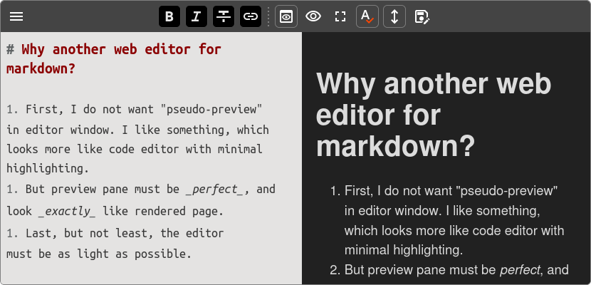

# Bare MDE :bear:

Bare markdown editor, based on CodeJar. It's a Preact component, bundled* as umd module. I've made it initially for my pet projects.

Probably, not the embedable markdown editor you're looking for.

- As minimal, as possible (about 60Kb when built)
- Browser native spellcheck
- Fully isolated preview panel, pixel-perfect preview possible
- Split preview, full width preview
- Sync preview scroll (more or less accurate)
- Basic formatting buttons
- Fullscreen mode
- Passed by upper-level component:
   * Preview render function 
   * Save function
   * External preview function

:memo: License: LGPL 3.0

\* without Preact

